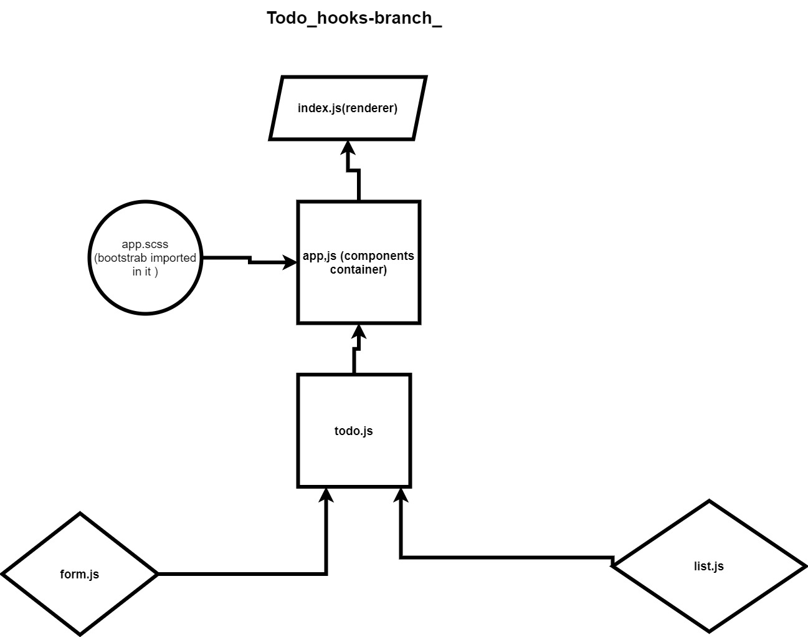

# LAB - Class:31 (todo)

## Author: Mohammad Quthama

- [submission PR](https://github.com/mohammad-qethama/todo/pull/1)
- [master-deployment](https://mohammad-qethama.github.io/todo/)

### Setup

- `PORT` - 3000

#### Dependencies

- react.
- react-dom.
- react-scripts.
- react-pre
- web-vitals
- node-sass@4.14.1
- react-bootstrab 
- uuid

#### Devdependencies

- eslint
- gh-pages

#### Running the app

- `npm start`

- find the app @(https:localhost/:3000)

#### UML

